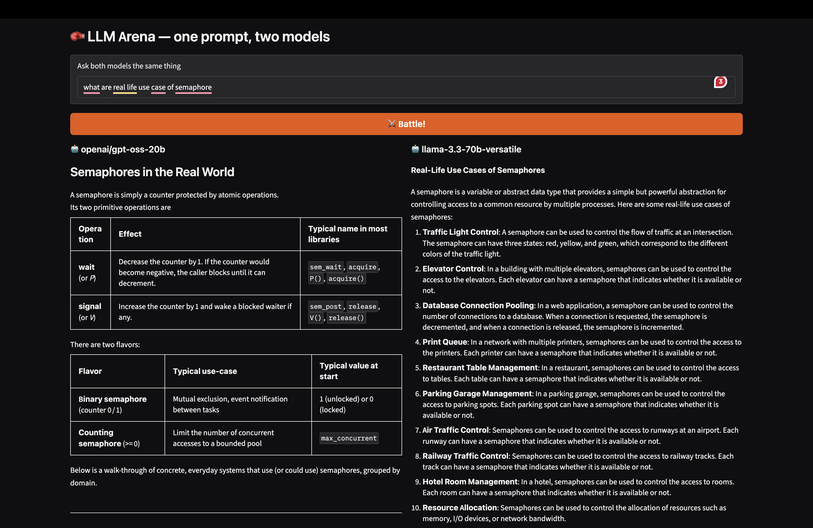

# 🤖 LLM Comparison Playground

Compare responses from multiple Large Language Models (LLMs) side by side using the same prompt. This application helps you evaluate differences in reasoning, writing style, and overall response quality.

## 🚀 Features

- Compare multiple LLMs with a single prompt
- Side-by-side response comparison
- Clean and interactive Gradio interface
- Powered by the Groq API
- Easy to extend with additional models

## 📸 Demo


---

## 🛠️ Tech Stack

- Python
- Gradio
- Groq API
- OpenAI Python SDK (Groq Compatible)
- python-dotenv

---

## 📂 Project Structure

```
.
├── app.py
├── .env
├── requirements.txt
└── README.md
```

---

## ⚙️ Installation

### 1. Clone the repository

```bash
git clone https://github.com/Nikhil-Sachan28/LLM-Comparison-Tool.git
cd LLM-Comparison-Tool
```

### 2. Create a virtual environment

```bash
python -m venv .venv
```

Activate it:

**Windows**

```bash
.venv\Scripts\activate
```

**macOS/Linux**

```bash
source .venv/bin/activate
```

### 3. Install dependencies

```bash
pip install -r requirements.txt
```

---

## 🔑 Configure Environment Variables

Create a `.env` file in the project root.

```env
GROQ_API_KEY=your_groq_api_key
```

---

## ▶️ Run the Application

```bash
python app.py
```

The application will be available at:

```
http://127.0.0.1:7860
```

---

## 📦 Requirements

```
gradio
openai
python-dotenv
```

---

## 🤖 Models

The project can compare any models available through the Groq API.

Example:

- GPT-OSS 20B
- GPT-OSS 120B
- Llama 3.3 70B
- Any future Groq-supported model

Simply change the model names in the code to experiment with different LLMs.

---

## 🎯 Future Improvements

- Compare more than two models
- Streaming responses
- Response time comparison
- Token usage statistics
- Export responses to Markdown/PDF
- Conversation history
- Custom system prompts
- Model parameter controls (temperature, max tokens, etc.)

---

## 🤝 Contributing

Contributions and suggestions are welcome.

If you find a bug or have an idea for improvement, feel free to open an issue or submit a pull request.

---

## 📄 License

This project is licensed under the MIT License.

---

⭐ If you found this project useful, consider giving it a star!